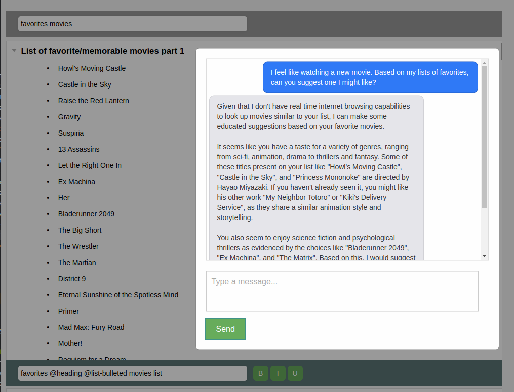
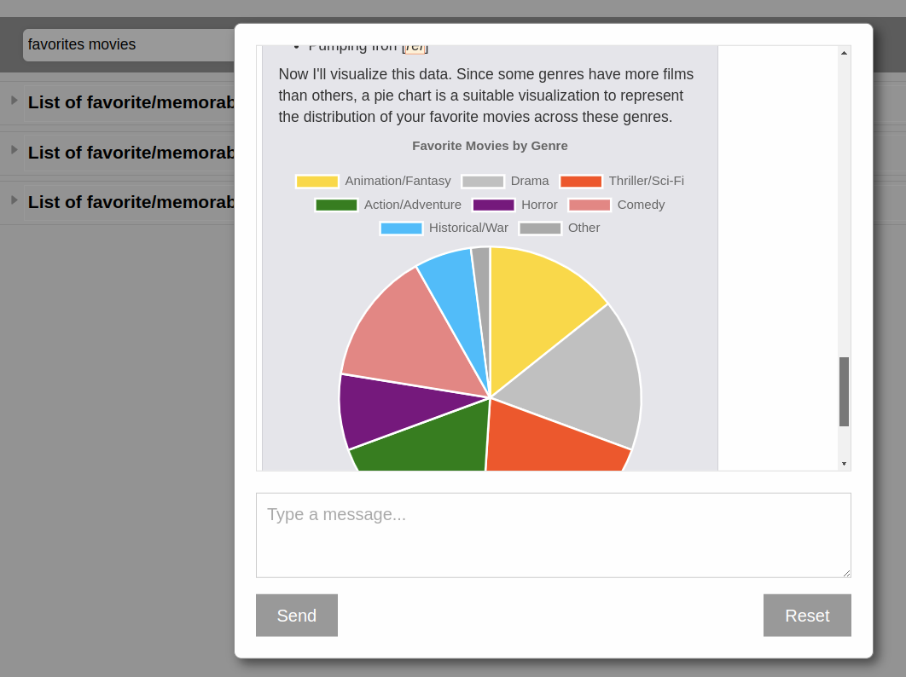
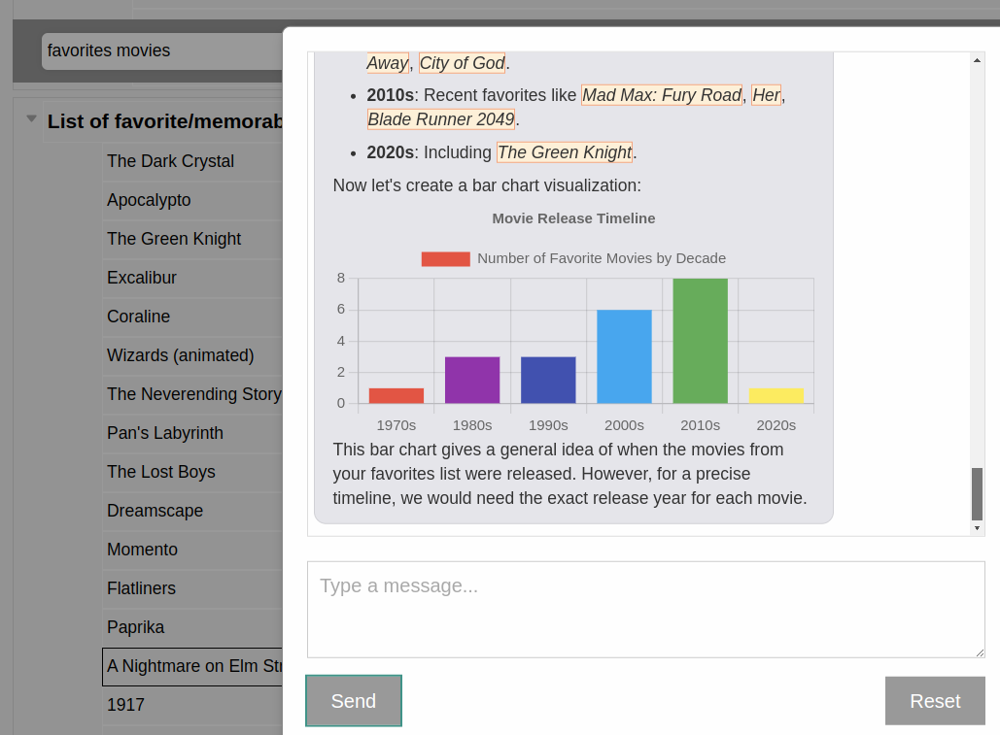

# MetaList

MetaList is a personal knowledge management web app that is tightly integrated with an LLM chat interface with RAG.

Some examples of interactions with the chat feature:






Search filters down to relevant notes, which has the nice 
effect of acting as a form of human-guided [retrieval augmented generation](https://www.promptingguide.ai/techniques/rag).

## Features

- Tags
- Search
- OpenAI API integration
- Markdown/LaTeX support

## Future features

- Export to HTML
- Export to PDF
- Export to Markdown
- Export to JSON

## Installation

It is recommended that you create a Python virtual environment before installing MetaList.

```bash
python3 -m venv venv
source venv/bin/activate
```

Then, install MetaList using pip:

```bash
pip install metalist
```

## Usage

Navigate to `http://127.0.0.0:8080/`

## License

MetaList is licensed under the MIT license. See [LICENSE](LICENSE) for more information.

