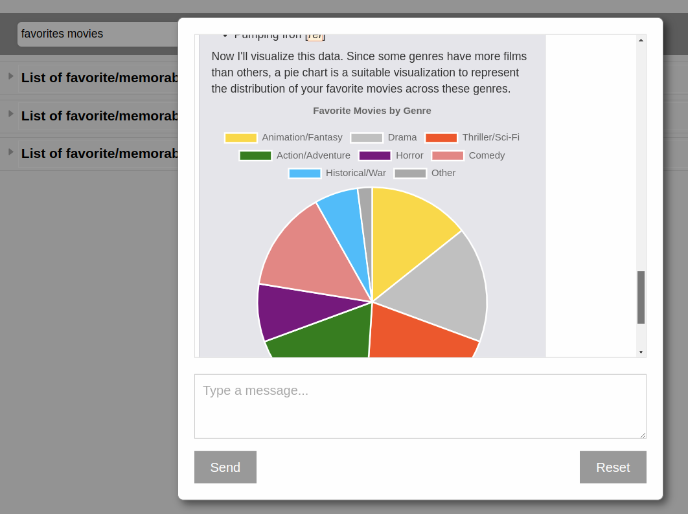
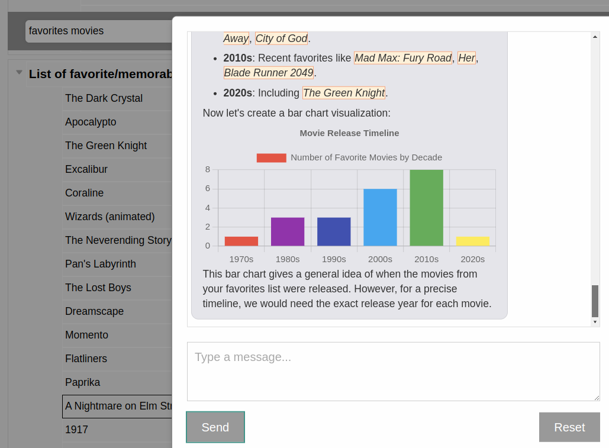

# MetaList


[](https://pypi.org/project/metalist/)


## What is MetaList?
MetaList is a personal knowledge management web application, 
tightly integrated with large language models.

> ⚠️ **MetaList is currently in Development**: Expect breaking changes and bugs

## Features

- [x] Chat feature: LLM integration (currently only [OpenAI API](https://openai.com/blog/openai-api))
- [x] [Chart.js](https://www.chartjs.org/) integration for LLM-generated visualizations
- [x] Hierarchical, collapsable note structure
- [x] Reordering notes in one context survives to other search contexts; notes maintain a [total order](https://en.wikipedia.org/wiki/Total_order)
- [x] Quick, responsive searching (tags, full-text, or combo of both)
- [x] Search suggestions
- [x] Tagging
- [x] Tag suggestions (uses a [Jaccard index](https://en.wikipedia.org/wiki/Jaccard_index))
- [x] Tags can imply other tags
- [x] Tag implication rules are also notes; they can themselves be tagged and searched
- [x] Nested subitems in notes inherit tags from their parents
- [x] [Markdown](https://markdown-it.github.io/)/[LaTeX](https://katex.org/) support
- [x] Infinite undo/redo
- [x] Infinite scrolling

###  Chat Feature Example

Search filters notes down to a relevant subset (a "search context"), which has the nice 
effect of acting as a form of human-guided [retrieval augmented generation](https://www.promptingguide.ai/techniques/rag).
The chat feature is fully integrated with the underlying notes. Mousing over a reference in the chat will highlight 
the referenced note, if it is within view, and clicking on the reference will navigate to and select the note, 
even opening up collapsed items in the note hierarchy so that all the relevant info becomes visible.

Some examples of interactions with the chat feature (in this case, recommending new movies):



<!---->

## Installation

It is recommended that you create a Python virtual environment before installing MetaList.

```bash
python3 -m venv venv
source venv/bin/activate
```

Then, install MetaList using pip:

```bash
pip install metalist
```

## Usage

From the installation directory, run:
```
metalist
```

Navigate to `http://127.0.0.0:8080/`

Read the [cheatsheet](docs/cheatsheet.md).

## Roadmap

- [ ] Chat integration with other models
- [ ] Menus / Settings
- [ ] Reminders
- [ ] Passwords / encryption at rest
- [ ] Import data from browser bookmarks
- [ ] Import data from other PKM apps
- [ ] Export notes to JSON, Markdown, HTML, PDF
- [ ] File handling
- [ ] Access to local file system
- [ ] Multi-user
- [ ] Mobile friendly
- [ ] More unit/integration testing

## License

MetaList is licensed under the MIT license. See [LICENSE](LICENSE) for more information.

