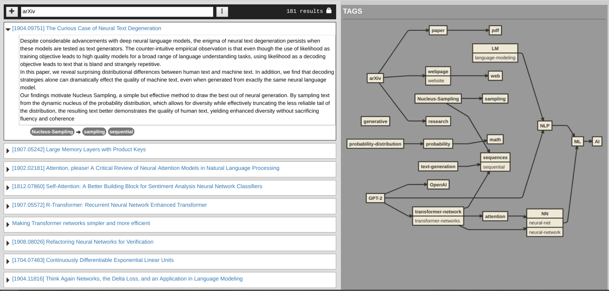

# MetaList

*A simple yet powerful means of tagging and organizing information.*

## Getting Started

1. Install nodejs
2. Download this repo
3. Navigate to `Metalist/server` and run `npm install`
4. Run `node app.js`
5. In a browser (currently Chrome or Firefox), navigate to `localhost:3000`

Documentation to follow shortly... please refer to the [wiki](https://github.com/evolvingstuff/MetaList/wiki).

## License

This project is licensed under the MIT License - see the [LICENSE.md](LICENSE.md) file for details

## Acknowledgments

* Thanks to Rob Hruska for the awesome logo.
