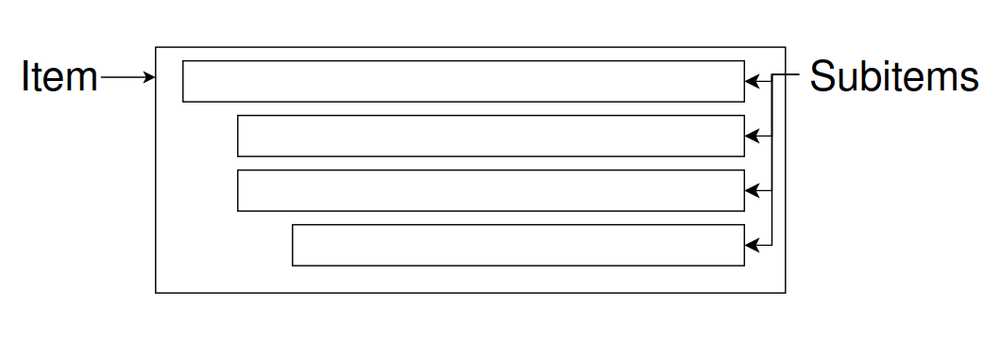

# MetaList Cheatsheet

## Overview
- Minimalistic UI; mostly keyboard-driven interactions.
- Items are composed of subitems, nested hierarchically:
  

---

## Operations
- **Search**: 
  - Enter keywords in input bar at top.
  - Search Queries are a combination of tags and text, e.g.: 
`favorites movies "Tom Hanks"` is searching for all subitems that have
(or inherit) the tags `favorites` and also `movies` and also have the text 
"Tom Hanks" somewhere in the content.
  - Negative Queries work as well, e.g.:
`favorites movies -horror` requires the tag `favorites`, `movies`, but *not* `horror`.
- **New Top-Level Item**: 
  - With nothing selected, press `Enter`.
  - Newly created items inherit tags from the search bar.
  - Newly created items go directly into content editing mode by default.
- **Select Item/Subitem**
  - Two levels of selection:
    1. **Selected (1st click)**: Allows moving item/subitem, adding tags, and some other operations.
    2. **Content Editing Mode (2nd click)**: Allows for direct editing of subitem content.
- **Deselect**: 
  - Click outside the subitem, or press `Escape`.
- **New Sibling**: 
  - With item/subitem selected, press `Shift + Enter`.
- **New Child (indented)**: 
  - With item/subitem selected, press `Ctrl + Shift + Enter`.
- **Delete**: 
  - With item/subitem selected, press `Delete`.
- **Move**
  - With selected item/subitem selected:
    - Move Item/Subitem Up: `Up Arrow`.
    - Move Item/Subitem Down: `Down Arrow`.
    - Indent Subitem: `Right Arrow`.
    - Outdent Subitem: `Left Arrow`.
- **Edit Content**:
  - With selected subitem in content editing mode, interact as you would in a typical text editor:
    - Copy Content: `Ctrl + C`.
    - Cut Content: `Ctrl + X`.
    - Paste Content: `Ctrl + V`.
    - Undo Edits: `Ctrl + Z`.
    - Redo Edits: `Ctrl + Y`.
- **Copy/Paste Child/Sibling**: 
   - With selected item/subitem selected:
     - Copy Item/Subitem: `Ctrl + C`.
     - Cut Item/Subitem: `Ctrl + X`.
     - Paste Item/Subitem Sibling: `Ctrl + V`.
     - Paste Item/Subitem Child (indented): `Ctrl + Shift + V`.
- **Edit Tags**: 
  - With selected item/subitem selected, enter tags in input bar at bottom.
- **Undo/Redo Operations**:
  - Undo: `Ctrl + Z`.
  - Redo: `Ctrl + Y`.
  - Infinite undo/redo (except when search changes, then the stack is reset).
- **Chat with LLM**
  - Click chat icon in lower right corner.
  - Will need to enter an OpenAI API key the first time.
  - Chat message history resets on closing the chat window (ephemeral; not saved).

---

## Operations Chart:

| Action                | No Selection       | Item Selected      | Content Editing Mode |
|-----------------------|--------------------|--------------------|----------------------|
| Search                | ✅                  | ✅                  | ✅                    |
| New Top Level Item    | ✅                  |                    |                      |
| Select Item/Subitem   | ✅                  | ✅                  | ✅                    |
| Deselect              |                    | ✅                  | ✅                    |
| New Sibling           |                    | ✅                  |                      |
| New Child             |                    | ✅                  |                      |
| Delete                |                    | ✅                  |                      |
| Move                  |                    | ✅                  |                      |
| Edit Content          |                    | ✅                  | ✅                    |
| Copy/Cut Item/Subitem |                    | ✅                  |                      |
| Paste Sibling/Child   |                    | ✅                  |                      |
| Edit Tags             |                    | ✅                  | ✅                    |
| Undo / Redo Ops       | ✅                  | ✅                  |                      |
| Chat w LLM            | ✅                  | ✅                  | ✅                    |

