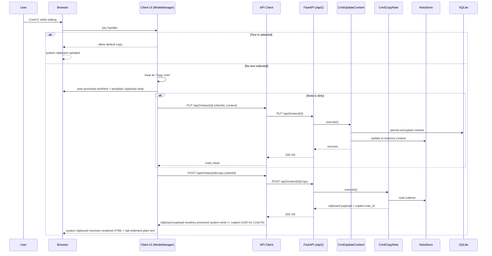

# Copy Note Flow

High-level flow: if the currently edited note is dirty, save first so the copied note includes the latest edits.

Related behavior: Cmd+X (cut note when no selection) uses the same copy flow and then deletes the note (undoable via delete-subtree undo).
Related behavior: Cmd+R uses the copied note UUID from this flow (`note_id` in copy response) to copy as embedded reference (`![[UUID]]`) while editing.
Related behavior: Cmd+V into a target note with no visible content and no children replaces that target with the copied root note, while preserving/merging the target's context tags with the copied root tags using case-insensitive dedupe.
Direct unresolved tag proposals are part of the internal clipboard subtree and survive copy, duplication, normal paste, and blank-target replacement. They remain separate from accepted tags and are not rendered into the system clipboard's human-readable HTML/plain-text forms.

## Embedded document copy semantics

The internal subtree clipboard also snapshots directly embedded diagram payloads.
Each normal paste clones once per distinct document and rewrites the copied tokens,
including child/sibling and blank-target paste. Snapshot timing is copy time; later
source edits do not alter the copy. Cmd+R keeps original note/document identity.
Document cloning does not follow other embedded note references. Undo/redo restores
the same cloned UUIDs. See `../ui/diagram-widgets.md`.
