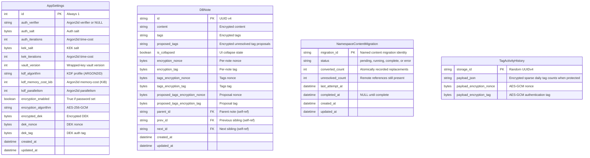

# Database Schema

Core SQLite structures include AppSettings (singleton), DBNote (hierarchical linked list), and a namespace-local content-migration ledger. Additional feature tables are documented with their owning services.

